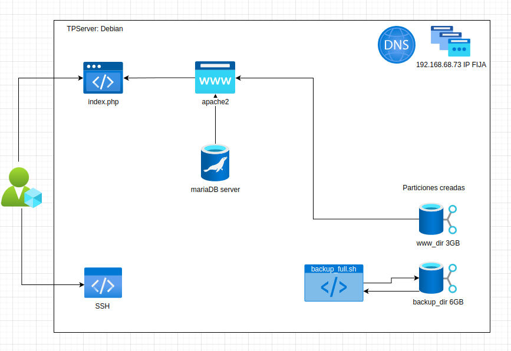

# tp-computacion-Aplicada-grupo-2
Computación Aplicada - Grupo 2

# Integrantes
Matias Basilico
Luciano Yomayel

## Descomprimir directorio var

Dado que Github admite maximo 100 Mb, utilizando split partimos el archivo en distintas partes de 25mb para poder restaurarlos es
> cat var_bkp_part_* > var_bkp_20241118.tar.gz